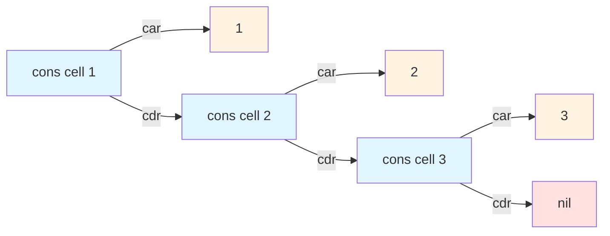

# Cons Cells

Cons cells are the fundamental building blocks of lists in both Lisp and Erlang, and by extension, LFE. Understanding cons cells is essential to mastering list manipulation and pattern matching in LFE. While the concept originates from Lisp, Erlang (and thus LFE) adapts it in ways that make it particularly powerful for functional programming and recursive operations.

## Lisp Cons Cells

In Lisp dialects, a cons cell is a fundamental data structure that holds two values or pointers to values. These two slots are traditionally called the CAR (Contents of the Address Register) and the CDR (Contents of the Decrement Register), names that derive from the original Lisp implementation on IBM 704 hardware.

The cons function constructs these memory objects, and the expression "to cons x onto y" means to construct a new cons cell with x in the car slot and y in the cdr slot.

### Structure and Notation

A simple cons cell holding two values can be represented in dotted pair notation:

```
(cons 'a 'b)  ; Creates a cons cell
=> (a . b)    ; Dotted pair notation
```

Lists in Lisp are built by having the car slot contain an element and the cdr slot point to another cons cell or to nil (the empty list). This creates a singly-linked list structure:

```
(cons 1 (cons 2 (cons 3 nil)))
=> (1 2 3)
```

### Visual Representation

Here's a diagram showing how the list `(1 2 3)` is constructed from cons cells:



Each cons cell contains two pointers: the car points to the element value, and the cdr points to the next cons cell (or nil for the last cell).

## Erlang Cons Cells

Erlang lists are built as sequences of cons cells, with each cell composed of a value and a pointer to another cons cell or empty list. While structurally similar to Lisp cons cells, Erlang's implementation and usage patterns differ in important ways.

### The Pipe Operator

In Erlang, the cons operator is represented by the pipe symbol (|), which separates the head of a list from its tail. The syntax `[Head | Tail]` constructs or pattern-matches a cons cell.

```erlang
% Building a list with cons
[1 | [2, 3]]      % => [1, 2, 3]
[1 | [2 | [3]]]   % => [1, 2, 3]
[1 | [2 | [3 | []]]]  % => [1, 2, 3]
```

### Pattern Matching and Head/Tail

Every function operating on lists in Erlang is defined in terms of two primitives: head and tail, which return the first element and the rest of the list respectively. Pattern matching with cons cells provides an elegant idiom for recursive list operations, where you can extract the head and tail in function definitions.

```erlang
% Pattern matching to extract head and tail
[Head | Tail] = [1, 2, 3].
% Head => 1
% Tail => [2, 3]
```

This makes recursive list processing natural and efficient:

```erlang
length([]) -> 0;
length([_Head | Tail]) -> 1 + length(Tail).
```

### Proper vs Improper Lists

A proper list in Erlang ends with an empty list as its last cell. When the tail of the last cons cell contains something other than another cons cell or the empty list, you have an improper list:

```erlang
[1 | 2]      % Improper list - tail is not a list
[1 | [2]]    % Proper list
```

While improper lists are valid Erlang terms, most standard list functions expect proper lists.

## LFE Cons Cells

LFE provides Lisp-style syntax for working with Erlang's cons cell implementation, giving you the best of both worlds: familiar Lisp notation with Erlang's powerful pattern matching.

### The `cons` Function

In LFE, the `cons` function creates a new list by prepending an element to an existing list:

```lisp
lfe> (cons 1 '())
(1)
lfe> (cons 1 '(2 3))
(1 2 3)
lfe> (cons 1 (cons 2 (cons 3 '())))
(1 2 3)
```

### Pattern Matching with Cons

LFE allows pattern matching on cons cells in function definitions, making recursive list processing elegant and readable:

```lisp
lfe> (defun my-length
  (('()) 0)
  (((cons _ tail)) (+ 1 (my-length tail))))
my-length
lfe> (my-length '(a b c d))
4
```

In this example:
- The first clause matches the empty list `()` and returns 0
- The second clause uses `(cons _ tail)` to extract the tail, ignoring the head with `_`
- The function recursively processes the tail

### Common Patterns

Here are some common patterns for working with cons cells in LFE:

**Accessing the head and tail:**

```lisp
lfe> (set (cons head tail) '(1 2 3 4))
(1 2 3 4)
lfe> head
1
lfe> tail
(2 3 4)
```

**Building lists incrementally:**

```lisp
lfe> (defun build-list (n)
  (build-list n '()))

lfe> (defun build-list
  ((0 acc) acc)
  ((n acc) (build-list (- n 1) (cons n acc))))

lfe> (build-list 5)
(1 2 3 4 5)
```

**Pattern matching in `let` bindings:**

```lisp
lfe> (let (((cons first (cons second rest)) '(a b c d e)))
  (list first second rest))
(a b (c d e))
```

**Recursive list transformation:**

```lisp
lfe> (defun double-all
  (('()) '())
  (((cons h t)) (cons (* 2 h) (double-all t))))

lfe> (double-all '(1 2 3 4 5))
(2 4 6 8 10)
```

### Using Backtick Syntax

LFE also supports backtick (quasiquote) syntax for pattern matching, which can be more concise:

```lisp
lfe> (set `(,first ,second . ,rest) '(1 2 3 4 5))
(1 2 3 4 5)
lfe> first
1
lfe> second
2
lfe> rest
(3 4 5)
```

The dot (`.`) in the pattern `(,first ,second . ,rest)` represents the cons operator, separating the explicitly matched elements from the remaining tail.

### List Construction vs Traversal

One crucial performance consideration: prepending to a list with `cons` is O(1), but appending to the end requires traversing the entire list and is O(n):

```lisp
; Fast - O(1)
lfe> (cons 0 '(1 2 3))
(0 1 2 3)

; Slow for large lists - O(n)
lfe> (++ '(1 2 3) '(4))
(1 2 3 4)
```

This is why many recursive functions in LFE build lists in reverse order using an accumulator, then reverse the final result:

```lisp
(defun map-helper (f lst acc)
  (case lst
    ('() (lists:reverse acc))
    ((cons h t) (map-helper f t (cons (funcall f h) acc)))))

(defun my-map (f lst)
  (map-helper f lst '()))
```

## Predicates

To check if a value is a list (a chain of cons cells ending in `[]`), you can use the standard predicates:

```lisp
lfe> (is_list '(1 2 3))
true
lfe> (is_list '())
true
lfe> (is_list 42)
false
```

With Common Lisp-style predicates:

```lisp
lfe> (include-lib "lfe/include/cl.lfe")
lfe> (listp '(1 2 3))
true
lfe> (listp '())
true
```

Or Clojure-style:

```lisp
lfe> (include-lib "lfe/include/clj.lfe")
lfe> (list? '(1 2 3))
true
```

## Summary

Cons cells are the foundation of list processing in LFE. Understanding how they work—as pairs of values forming linked structures—is essential for effective functional programming. The ability to pattern match on cons cells makes LFE code both elegant and efficient, allowing you to express complex list operations with clarity and precision.

The key insights to remember:
- Lists are chains of cons cells terminating in the empty list `()`
- Pattern matching with `(cons head tail)` is the idiomatic way to destructure lists
- Prepending with `cons` is fast; building lists in reverse and then reversing is a common pattern
- Proper lists always end in `[]`, while improper lists end in other values
