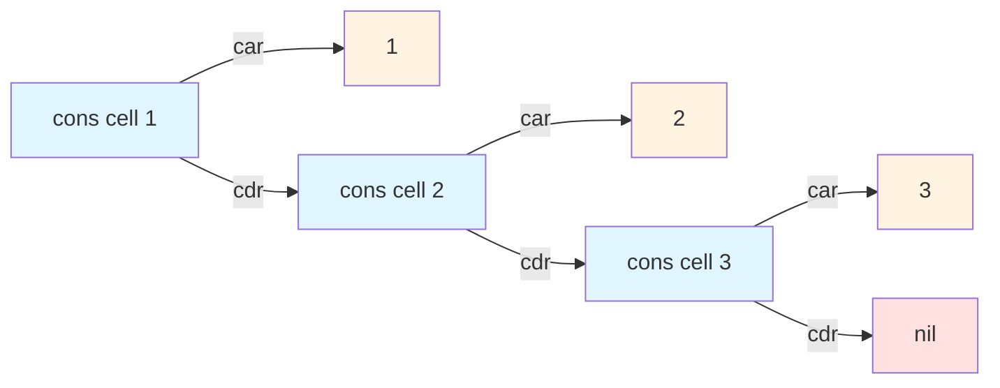

# Lisp Cons Cells

In Lisp dialects, a cons cell is a fundamental data structure that holds two values or pointers to values. These two slots are traditionally called the CAR (Contents of the Address Register) and the CDR (Contents of the Decrement Register), names that derive from the original Lisp implementation on IBM 704 hardware.

The cons function constructs these memory objects, and the expression "to cons x onto y" means to construct a new cons cell with x in the car slot and y in the cdr slot.

## Structure and Notation

A simple cons cell holding two values can be represented in dotted pair notation:

```
(cons 'a 'b)  ; Creates a cons cell
=> (a . b)    ; Dotted pair notation
```

Lists in Lisp are built by having the car slot contain an element and the cdr slot point to another cons cell or to nil (the empty list). This creates a singly-linked list structure:

```
(cons 1 (cons 2 (cons 3 nil)))
=> (1 2 3)
```

## Visual Representation

Here's a diagram showing how the list `(1 2 3)` is constructed from cons cells:



Each cons cell contains two pointers: the car points to the element value, and the cdr points to the next cons cell (or nil for the last cell).
