# Execution Flow

```mermaid
graph TD
    A[Start: app_discovery provider] --> B[Get lib_dirs from state]
    B --> C[Get src_dirs from opts]
    C --> D[find_apps: Scan directories]

    D --> D1[For each lib_dir]
    D1 --> D2[Build file patterns]
    D2 --> D3[Search for app resources]

    D3 --> D4{Resource files found?}
    D4 -->|app| D5[ebin/*.app]
    D4 -->|app_src| D6[src/*.app.src]
    D4 -->|script| D7[src/*.app.src.script]
    D4 -->|mix_exs| D8[mix.exs]

    D5 --> E[For each found file]
    D6 --> E
    D7 --> E
    D8 --> E

    E --> E1[Determine app directory]
    E1 --> E2[Read rebar.config if exists]
    E2 --> E3[Create app_info record]
    E3 --> E4[Parse app resource file]

    E4 --> E5{Valid app?}
    E5 -->|Yes| E6[Extract app metadata]
    E5 -->|No| E7[Skip this app]

    E6 --> E8[Store in project_apps list]

    E7 --> F{More files?}
    E8 --> F
    F -->|Yes| E
    F -->|No| G[define_root_app]

    G --> G1{App at root dir?}
    G1 -->|Yes| G2[Return app name as root]
    G1 -->|No| G3[Return 'root' atom]

    G2 --> H[Parse dependencies per profile]
    G3 --> H

    H --> H1[For each profile]
    H1 --> H2[Get deps from config]
    H2 --> H3[Deduplicate deps]
    H3 --> H4[Parse with parse_profile_deps]
    H4 --> H5[Store as parsed_deps]

    H5 --> I[Merge app configurations]
    I --> I1[For each discovered app]
    I1 --> I2{Is top-level app?}
    I2 -->|Yes| I3[Use state opts directly]
    I2 -->|No| I4[Apply overrides]

    I3 --> I5[Apply profiles]
    I4 --> I5

    I5 --> I6[Verify OTP version]
    I6 --> I7[Handle app deps per profile]
    I7 --> I8[Set out_dir to _build/PROFILE/lib/APPNAME]
    I8 --> I9[Add to project_apps]

    I9 --> I10{More apps?}
    I10 -->|Yes| I1
    I10 -->|No| J[Install project app plugins]

    J --> K[Return updated state]

    style A fill:#e1f5ff
    style K fill:#e1ffe1
```

## Detailed Steps

1. **Directory Scanning** (`find_apps/4`)
   - Get `lib_dirs` from configuration (default: `["apps"]`)
   - Get `src_dirs` from configuration (default: `["src"]`)
   - For each lib directory, search for application resource files
   - Build file patterns: `lib_dir/src_dir/*.{app,app.src,app.src.script}`, `lib_dir/ebin/*.app`, `lib_dir/mix.exs`

2. **Application Resource File Detection**
   - `.app`: Compiled application resource file (in `ebin/`)
   - `.app.src`: Application resource source file (in `src/` or other src_dir)
   - `.app.src.script`: Scriptable app.src (evaluated as Erlang code)
   - `mix.exs`: Elixir Mix project file (for Elixir interop)

3. **Application Directory Determination**
   - From file path, extract parent directory as app directory
   - Example: `apps/my_app/src/my_app.app.src` → app dir is `apps/my_app/`

4. **Configuration Loading**
   - For each app directory, check for `rebar.config`
   - If exists, parse and merge with parent configuration
   - Create `rebar_app_info:t()` record

5. **Application Parsing** (`find_app_/5`)
   - Parse application resource file
   - Extract application metadata:
     - Name (atom)
     - Version
     - Applications (runtime dependencies)
     - Included applications
     - Modules list
     - Other application-specific settings
   - Validate application structure

6. **Root App Detection** (`define_root_app/2`)
   - Check if any discovered app is at project root directory
   - If yes: single-app project, return app name
   - If no: umbrella project, return `root` atom

7. **Dependency Parsing Per Profile** (`parse_profile_deps/5`)
   - For each active profile (default, test, prod, etc.)
   - Get dependencies from `{deps, Profile}` configuration
   - Parse into `rebar_app_info:t()` records
   - Store as `{parsed_deps, Profile}` in state

8. **Configuration Merging** (`merge_opts/3`)
   - For each discovered application:
     - If top-level app: use state opts directly
     - If sub-app: apply overrides from parent config
     - Apply active profiles
     - Verify OTP version requirements
     - Merge dependencies from app and parent

9. **Output Directory Assignment**
   - Set `out_dir` for each app
   - Usually: `_build/PROFILE/lib/APPNAME/`
   - Ensures compiled artifacts go to correct location
