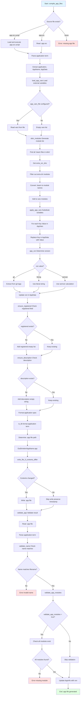

# Execution Flow

```mermaid
graph TD
    A[Start: compile_app_files] --> B{Source file exists?}

    B -->|app.src.script| C[Load and execute .app.src.script]
    B -->|app.src| D[Read .app.src]
    B -->|None| E[Error: missing app file]

    C --> F[Parse application term]
    D --> F

    F --> F1[Extract application, AppName, AppData]
    F1 --> G[load_app_vars Load external variables]

    G --> G1{app_vars_file configured?}
    G1 -->|Yes| G2[Read vars from file]
    G1 -->|No| G3[Empty vars list]

    G2 --> H[ebin_modules Generate module list]
    G3 --> H

    H --> H1[Find all .beam files in ebin/]
    H1 --> H2[Get extra_src_dirs]
    H2 --> H3[Filter out extra dir modules]
    H3 --> H4[Convert .beam to module names]
    H4 --> H5[Add to vars modules]

    H5 --> I[apply_app_vars Substitute variables]
    I --> I1[For each Key Value in AppVars]
    I1 --> I2[Replace Key in AppData with Value]

    I2 --> J[app_vsn Determine version]
    J --> J1{vsn value?}
    J1 -->|git| J2[Extract from git tags]
    J1 -->|String| J3[Use literal string]
    J1 -->|semver| J4[Use semver calculation]

    J2 --> K[Update vsn in AppData]
    J3 --> K
    J4 --> K

    K --> L[ensure_registered Check registered field]
    L --> L1{registered exists?}
    L1 -->|No| L2[Add registered empty list]
    L1 -->|Yes| L3[Keep existing]

    L2 --> M[ensure_description Check description]
    L3 --> M

    M --> M1{description exists?}
    M1 -->|No| M2[Add description empty string]
    M1 -->|Yes| M3[Keep existing]

    M2 --> N[Format application spec]
    M3 --> N

    N --> N1[io_lib format application term]
    N1 --> O[Determine .app file path]

    O --> O1[OutDir/ebin/AppName.app]
    O1 --> P[write_file_if_contents_differ]

    P --> P1{Contents changed?}
    P1 -->|Yes| P2[Write .app file]
    P1 -->|No| P3[Skip write preserve timestamp]

    P2 --> Q[validate_app Validate result]
    P3 --> Q

    Q --> Q1[Read .app file]
    Q1 --> Q2[Parse application term]
    Q2 --> Q3[validate_name Check name matches]

    Q3 --> Q4{Name matches filename?}
    Q4 -->|No| Q5[Error invalid name]
    Q4 -->|Yes| Q6[validate_app_modules]

    Q6 --> Q7{validate_app_modules = true?}
    Q7 -->|Yes| Q8[Check all modules exist]
    Q7 -->|No| Q9[Skip validation]

    Q8 --> Q10{All modules found?}
    Q10 -->|No| Q11[Error missing module]
    Q10 -->|Yes| R[Update AppInfo with vsn]

    Q9 --> R
    R --> S[End .app file generated]

    style A fill:#e1f5ff
    style S fill:#e1ffe1
    style E fill:#ffe1e1
    style Q5 fill:#ffe1e1
    style Q11 fill:#ffe1e1
```
