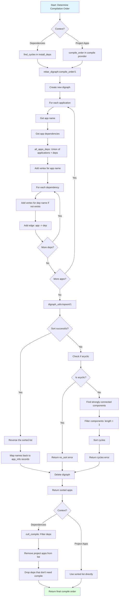

# Execution Flow

## Detailed Steps

1. **Graph Construction** (`compile_order/1`)
   - Create empty directed graph with `digraph:new/0`
   - For each application in the input list:
     - Extract application name
     - Get all dependencies (see `all_apps_deps/1`)
     - Add vertex for application name
     - For each dependency: add vertex and edge

2. **Dependency Collection** (`all_apps_deps/1`)
   - Get `applications` list from `.app` file (runtime dependencies)
   - Get `deps` list from `rebar.config` (build-time dependencies)
   - Convert both to binaries
   - Sort and merge (union of both lists)
   - This ensures all relevant dependencies are considered

3. **Topological Sort** (`digraph_utils:topsort/1`)
   - Standard Erlang digraph utility performs topological sort
   - Returns list in dependency order (dependencies first)
   - Returns `false` if graph contains cycles

4. **Cycle Detection** (on sort failure)
   - Check if graph is acyclic with `digraph_utils:is_acyclic/1`
   - If acyclic but sort failed: return `no_sort` error (rare edge case)
   - If not acyclic: find strongly connected components
   - Strongly connected components with length > 1 are cycles
   - Sort and return cycle information

5. **List Reversal**
   - `topsort` returns dependencies first
   - Reverse the list for compilation (dependencies last)
   - **Why reversed**: Original sort gives evaluation order; we want build order

6. **Name to AppInfo Mapping** (`names_to_apps/2`)
   - Sorted list contains application names (atoms/binaries)
   - Map back to full `rebar_app_info:t()` records
   - Preserve sort order
   - Skip any apps not found in original list

7. **Graph Cleanup**
   - Delete digraph with `digraph:delete/1`
   - Free memory
   - Return final sorted list

8. **Compilation Filtering** (`cull_compile/2` - for dependencies only)
   - Remove project applications from sorted dependency list
   - Drop dependencies that don't need compilation
   - Determine "needs compile" based on:
     - Checkout dependencies: always need compile
     - Source dependencies (Git, Hg): need compile
     - Package dependencies (Hex): may not need compile (pre-built)
