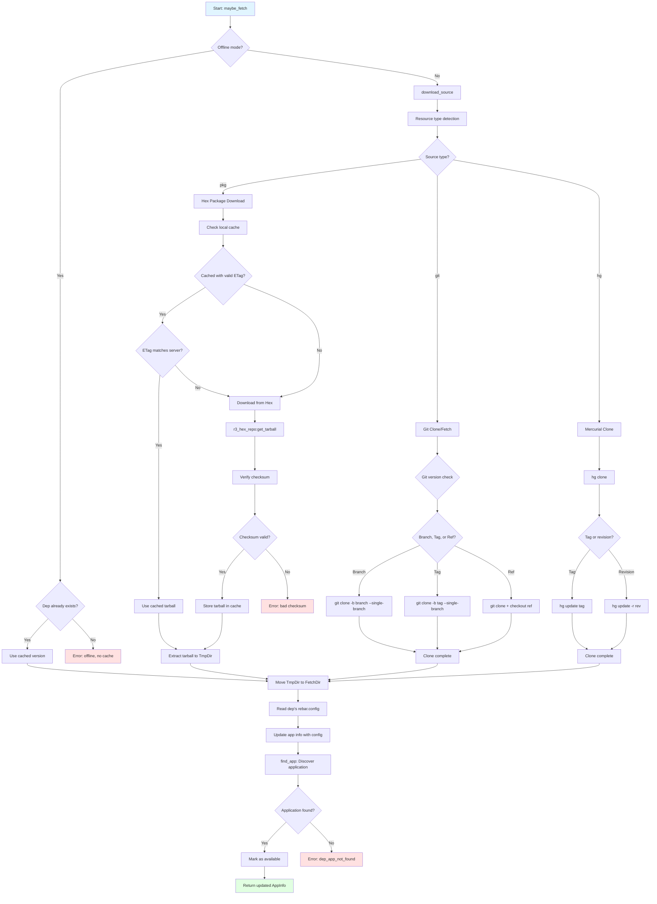

# Execution Flow

## Detailed Steps

1. **Fetch Decision** (`maybe_fetch/5`)
   - Check if dependency already exists locally
   - Check if update is needed
   - Skip if checkout dependency (already local)
   - Decide whether to fetch or use cached version

2. **Source Type Detection**
   - Determine resource type from source tuple:
     - `{pkg, Name, Version, _, _}` → Hex package
     - `{git, URL, RefSpec}` → Git repository
     - `{hg, URL, RevSpec}` → Mercurial repository

3. **Offline Mode Handling**
   - If offline mode and dependency not cached: error
   - If offline mode and dependency cached: use cache
   - Otherwise proceed with download

4. **Package Download (Hex)** (`rebar_pkg_resource:download/4`)
   - Check local cache directory for existing package
   - Read ETag file to get cached ETag
   - Request package from Hex with If-None-Match header
   - If 304 response: use cached tarball
   - If 200 response: download new tarball
   - Verify checksum against registry
   - Store tarball and ETag in cache
   - Extract tarball to temporary directory

5. **Git Clone** (`rebar_git_resource:download/4`)
   - Detect Git version for optimal clone command
   - For branches: `git clone -b branch --single-branch`
   - For tags: `git clone -b tag --single-branch`
   - For refs: `git clone` + `git checkout ref`
   - Clone to temporary directory
   - Handle authentication if required

6. **Mercurial Clone** (`rebar_hg_resource:download/4`)
   - Use `hg clone` to clone repository
   - Update to specific tag or revision
   - Clone to temporary directory

7. **Extraction and Placement**
   - Create temporary directory with `ec_file:insecure_mkdtemp/0`
   - Download/extract to temporary directory
   - Remove old cached version if exists
   - Move temporary directory to final location
   - Final location: `_build/PROFILE/lib/DEPNAME/`

8. **Post-Download Verification**
   - Read dependency's `rebar.config`
   - Update app info with dependency's configuration
   - Discover application structure with `rebar_app_discover:find_app/4`
   - Verify application is valid
   - Mark application as available
