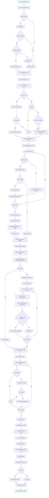

# Execution Flow

```mermaid
graph TD
    A[Start: DAG Operations] --> B[init: Load or Create DAG]

    B --> B1{DAG file exists?}
    B1 -->|Yes| B2[Read DAG file]
    B1 -->|No| B3[Create new DAG]

    B2 --> B4{Version matches?}
    B4 -->|Yes| B5{CritMeta matches?}
    B4 -->|No| B6[Discard DAG]
    B5 -->|Yes| B7[Restore graph from file]
    B5 -->|No| B6

    B6 --> B3
    B7 --> C[prune: Remove Deleted Files]
    B3 --> C

    C --> C1[Get all vertices in DAG]
    C1 --> C2[For each vertex not in Sources]
    C2 --> C3{Is source file?}
    C3 -->|Yes| C4[Check if in app paths]
    C3 -->|No| C5{Is artifact?}
    C5 -->|Yes| C6[Skip]
    C5 -->|No| C7{Has incoming edges?}

    C7 -->|No| C8[Delete vertex: header file removed]
    C7 -->|Yes| C6
    C4 --> C9{In app paths?}
    C9 -->|Yes| C10[Delete vertex + artifacts]
    C9 -->|No| C6

    C10 --> D[populate_sources: Add Sources]
    C8 --> D
    C6 --> D

    D --> D1[Create parallel worker pool]
    D1 --> D2[For each source file]
    D2 --> D3{Vertex exists?}
    D3 -->|Yes| D4[Get stored timestamp]
    D3 -->|No| D5[Add vertex with current timestamp]

    D4 --> D6{File modified?}
    D6 -->|Yes| D7[Update timestamp]
    D6 -->|No| D8[Skip unchanged]

    D7 --> D9[Queue dependency scan]
    D5 --> D9

    D9 --> D10{More sources?}
    D10 -->|Yes| D2
    D10 -->|No| D11[Wait for parallel scans]

    D11 --> D12[Process scan results]
    D12 --> D13[Add/update dependency edges]
    D13 --> D14[Mark DAG dirty]

    D14 --> E[populate_deps: Scan Headers]
    D8 --> E

    E --> E1[Find header files in DAG]
    E1 --> E2[Refresh timestamps for headers]

    E2 --> F[propagate_stamps: Propagate Timestamps]

    F --> F1{DAG dirty?}
    F1 -->|No| F2[Skip propagation]
    F1 -->|Yes| F3[Topological sort vertices]

    F3 --> F4[Reverse sort order]
    F4 --> F5[For each vertex, end to start]
    F5 --> F6[Get out-neighbors: dependencies]
    F6 --> F7[Find max timestamp of dependencies]
    F7 --> F8{Current < max dependency?}
    F8 -->|Yes| F9[Update to max timestamp]
    F8 -->|No| F10[Keep current]

    F9 --> F11{More vertices?}
    F10 --> F11
    F11 -->|Yes| F5
    F11 -->|No| G[compile_order: Inter-App Order]

    F2 --> G

    G --> G1[Build app-level DAG]
    G1 --> G2[For each file dependency edge]
    G2 --> G3{Is artifact edge?}
    G3 -->|Yes| G4[Skip]
    G3 -->|No| G5[Resolve files to apps]

    G5 --> G6{Same app?}
    G6 -->|Yes| G4
    G6 -->|No| G7[Add inter-app dependency]

    G7 --> G8{More edges?}
    G4 --> G8
    G8 -->|Yes| G2
    G8 -->|No| G9[Interleave sort]

    G9 --> H[Compilation Proceeds]

    H --> I[store_artifact: Track Outputs]
    I --> I1[For each compiled file]
    I1 --> I2[Add artifact vertex]
    I2 --> I3[Add artifact edge: artifact → source]
    I3 --> I4[Mark DAG dirty]

    I4 --> J[maybe_store: Save DAG]
    J --> J1{DAG dirty?}
    J1 -->|Yes| J2[Serialize DAG to disk]
    J1 -->|No| J3[Skip save]

    J2 --> K[terminate: Cleanup]
    J3 --> K
    K --> L[Delete in-memory DAG]

    style A fill:#e1f5ff
    style L fill:#e1ffe1
```
