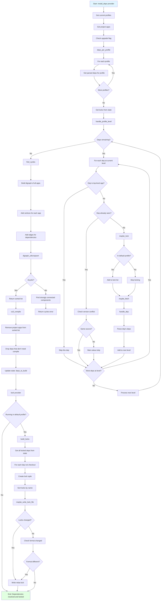

# Execution Flow

## Detailed Steps

1. **Profile-Based Dependency Collection** (`deps_per_profile/3`)
   - Get active profiles (e.g., `[default]`, `[default, test]`)
   - For each profile, get parsed dependencies
   - Load lock file data for consistency

2. **Level-Order Dependency Traversal** (`handle_profile_level/7`)
   - Process dependencies level by level (breadth-first)
   - Level 0: Direct dependencies from `rebar.config`
   - Level 1: Dependencies of level 0 dependencies
   - Continue until no more dependencies found

3. **Dependency Processing** (`update_dep/9`)
   - For each dependency:
     - Check if already seen (to avoid duplicates)
     - Check if it's a top-level app (skip if so)
     - Add to lock list if in default profile
     - Fetch the dependency (or verify it exists)
     - Parse the dependency's own dependencies
     - Add transitive deps to next level

4. **Lock Management** (`maybe_lock/5`)
   - Only lock dependencies in default profile
   - Skip checkout dependencies
   - Track dependency level (depth in tree)
   - Replace existing locks if new one is shallower

5. **Cycle Detection** (`find_cycles/1`)
   - Build directed graph of all applications
   - Vertices: application names
   - Edges: application → dependency relationships
   - Use `digraph_utils:topsort/1` for topological sort
   - If sort fails, find strongly connected components (cycles)

6. **Compilation Order** (`cull_compile/2`)
   - Start with topologically sorted dependency list
   - Remove project applications (they compile separately)
   - Drop dependencies that don't need compilation (already built)
   - Return final list for `deps_to_build`

7. **Lock File Writing** (`lock` provider)
   - Only runs in default profile
   - Build lock entries from state
   - Each lock: `{Name, Source, Level}`
   - Sort locks alphabetically
   - Write to `rebar.lock` if changed
   - Preserve lock file format version
