# Execution Flow

```mermaid
graph TD
    A[Start: rebar3 main/1] --> B[start_and_load_apps]
    B --> B1[Load rebar application]
    B1 --> B2[Start crypto, asn1, public_key]
    B2 --> B3{Offline mode?}
    B3 -->|No| B4[Start ssl, inets, httpc]
    B3 -->|Yes| C
    B4 --> C[init_config/0]

    C --> C1[Set HTTPC options]
    C1 --> C2[Initialize logging system]
    C2 --> C3[Consult rebar.config]
    C3 --> C4[Consult rebar.lock]
    C4 --> C5[Merge locks into config]
    C5 --> C6[Create initial state]
    C6 --> C7{Global config exists?}
    C7 -->|Yes| C8[Load global config]
    C7 -->|No| C9
    C8 --> C9[Set escript path]
    C9 --> C10[Initialize vsn cache]
    C10 --> D[run_aux]

    D --> D1[Set Unicode encoding]
    D1 --> D2{REBAR_PROFILE env set?}
    D2 -->|Yes| D3[Apply profile from env]
    D2 -->|No| D4
    D3 --> D4[Check minimum OTP version]
    D4 --> D5{HEX_CDN env set?}
    D5 -->|Yes| D6[Set CDN URL]
    D5 -->|No| D7
    D6 --> D7[Set compilers from app env]
    D7 --> D8[Create resources]
    D8 --> D9[Bootstrap test profile]
    D9 --> D10{REBAR_BASE_DIR env set?}
    D10 -->|Yes| D11[Override base_dir]
    D10 -->|No| D12
    D11 --> D12{REBAR_CACHE_DIR env set?}
    D12 -->|Yes| D13[Set global rebar dir]
    D12 -->|No| D14
    D13 --> D14[Create logic providers]
    D14 --> D15{REBAR_SKIP_PROJECT_PLUGINS?}
    D15 -->|No| D16[Install project plugins]
    D15 -->|Yes| D17
    D16 --> D17[Install top-level plugins]
    D17 --> D18[Set default opts]
    D18 --> D19[Parse command args]
    D19 --> D20{--offline flag?}
    D20 -->|Yes| D21[Set offline mode]
    D20 -->|No| D22
    D21 --> D22[Set code paths]
    D22 --> D23[init_command]
    D23 --> E[State Ready]

    style A fill:#e1f5ff
    style E fill:#e1ffe1
```

### Detailed Steps

1. **Application Loading** (`start_and_load_apps/1`)
   - Load the `rebar` application
   - Start required applications: `crypto`, `asn1`, `public_key`
   - If not offline: start `ssl`, `inets`, and create an httpc profile

2. **Base Configuration** (`init_config/0`)
   - Set HTTPC options for package downloads
   - Initialize logging with appropriate verbosity level
   - Read `rebar.config` from project root
   - Read `rebar.lock` if it exists
   - Merge lock data into configuration
   - Create initial state with merged configuration

3. **Global Configuration** (in `init_config/0`)
   - Check for `~/.config/rebar3/rebar.config`
   - If exists, load and merge with project configuration
   - Install global plugins (from global config)

4. **Environment Setup** (`run_aux/2`)
   - Set shell encoding to Unicode
   - Apply `REBAR_PROFILE` environment variable if set
   - Validate OTP version requirements
   - Configure Hex CDN URL if specified

5. **Compilers and Resources**
   - Load compilers from application environment
   - Create and register resource modules (for deps)
   - Bootstrap test profile with TEST macro and test directories

6. **Directory Configuration**
   - Set `base_dir` (default: `_build`, override with `REBAR_BASE_DIR`)
   - Set `global_rebar_dir` (default: `~/.cache/rebar3`, override with `REBAR_CACHE_DIR`)

7. **Provider and Plugin System**
   - Register built-in providers
   - Install project plugins (unless `REBAR_SKIP_PROJECT_PLUGINS` is set)
   - Install top-level plugins
   - Merge all provider lists

8. **Command Preparation**
   - Parse command-line arguments
   - Set offline mode if requested
   - Initialize code paths
   - Call `rebar_core:init_command/2` to dispatch to the actual command
