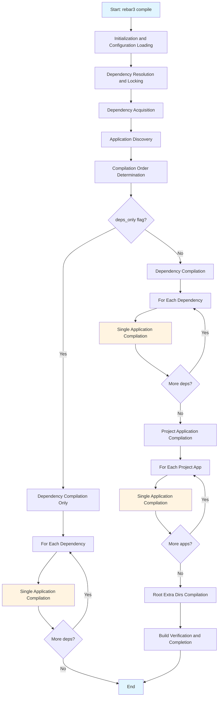
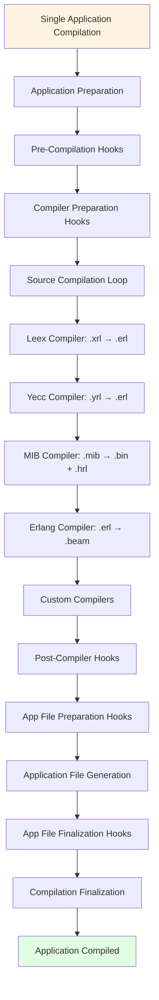
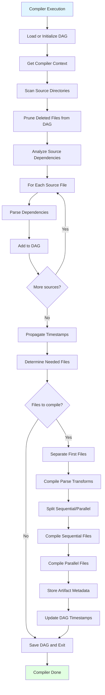
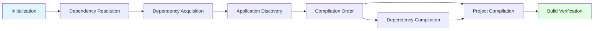

# Diagrams

## Flow Diagram

## Single Application Compilation Flow

## Individual Compiler Execution Flow

## Stage Dependencies

The following diagram shows dependencies between major stages:

