# Execution Flow

```mermaid
graph TD
    A[Start: compile/4] --> B[prepare_compile: Pre-hooks]
    B --> C[prepare_compilers: Pre-erlc hooks]
    C --> D[run_compilers]

    D --> D1[Load DAGs for all compilers]
    D1 --> D2[For each compiler module]

    D2 --> E[build_apps: Separate rebar3 vs custom]
    E --> E1{Project type?}
    E1 -->|rebar3| F[build_rebar3_apps]
    E1 -->|custom| G[build_custom_builder_app]

    G --> G1[Call Module:build/1]
    G1 --> D3

    F --> F1[analyze_all: Analyze all apps]
    F1 --> F2[For each app]
    F2 --> F3[Get compiler context]
    F3 --> F4[Find source files]
    F4 --> F5[Populate DAG with sources]
    F5 --> F6{More apps?}
    F6 -->|Yes| F2
    F6 -->|No| F7[Prune deleted files from DAG]

    F7 --> F8[populate_deps: Scan dependencies]
    F8 --> F9[propagate_stamps: Update timestamps]
    F9 --> F10[compile_order: Inter-app order]
    F10 --> F11[compile_analyzed: For each app]

    F11 --> H[run: Execute compilation]
    H --> H1[Find source files]
    H1 --> H2[needed_files: Determine what to compile]

    H2 --> H3[Split into FirstFiles, RestFiles]
    H3 --> H4{Parse transforms need compile?}
    H4 -->|Yes| H5[Recompile all files]
    H4 -->|No| H6[Compile only needed files]

    H5 --> I[Separate sequential/parallel]
    H6 --> I

    I --> I1[Compile FirstFiles sequentially]
    I1 --> I2[Build subgraph of dependencies]
    I2 --> I3[Topological sort needed files]
    I3 --> I4[Partition: sequential vs parallel]
    I4 --> I5[Compile sequential files]
    I5 --> I6[Compile parallel files in worker pool]

    I6 --> J[store_artifacts: Track in DAG]
    J --> D3{More compilers?}
    D3 -->|Yes| D2
    D3 -->|No| D4[Save DAGs to disk]

    D4 --> K[finalize_compilers: Post-erlc hooks]
    K --> L[prepare_app_file: Pre-app hooks]
    L --> M[compile_app_files: Generate .app]
    M --> N[finalize_app_file: Post-app hooks]
    N --> O[finalize_compile: Post-hooks]
    O --> P[Verify artifacts exist]
    P --> Q[End: Compiled]

    style A fill:#e1f5ff
    style Q fill:#e1ffe1
```

## Compilation Sub-Stages

The `compile/4` function executes these steps for each application:

1. **prepare_compile**: Run `pre_hooks` for `compile` stage
2. **prepare_compilers**: Run `pre_hooks` for `erlc_compile` stage
3. **run_compilers**: Execute all compiler modules (see below)
4. **finalize_compilers**: Run `post_hooks` for `erlc_compile` stage
5. **prepare_app_file**: Run `pre_hooks` for `app_compile` stage
6. **compile_app_files**: Generate `.app` from `.app.src` (see [Application File Generation](/part6/tooling/rebar3/internals/appflgen/))
7. **finalize_app_file**: Run `post_hooks` for `app_compile` stage
8. **finalize_compile**: Run `post_hooks` for `compile` stage, verify artifacts

## Compiler Execution Order

Compilers run in sequence (not parallel with each other):

1. **rebar_compiler_xrl** - Leex lexer (`.xrl` → `.erl`)
2. **rebar_compiler_yrl** - Yecc parser (`.yrl` → `.erl`)
3. **rebar_compiler_mib** - SNMP MIB (`.mib` → `.bin` + `.hrl`)
4. **rebar_compiler_erl** - Erlang source (`.erl` → `.beam`)
5. **Custom compilers** - Plugin-provided compilers

**Why Sequential**: Generated files from early compilers (e.g., `.erl` from `.yrl`) must be available for later compilers.
