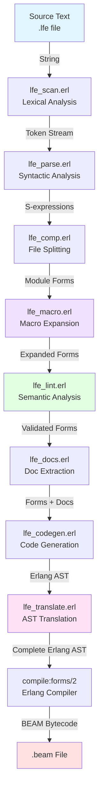

# Compilation Pipeline

The LFE compiler is a multi-stage pipeline where each stage performs a distinct transformation. The pipeline is **strictly linear and acyclic**—there are no back-edges or iterative refinement loops. This design simplifies reasoning about compilation and makes the pipeline highly composable.

**Key characteristics:**

- **One-way flow**: Each stage consumes input from previous stage, produces output for next
- **Explicit state threading**: Compilation state (`#comp{}` record) threaded through all stages
- **Error accumulation**: Errors collected but don't stop compilation (report all errors at once)
- **Incremental optimization**: Each stage can be stopped early for debugging/analysis
