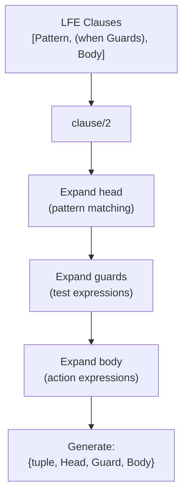

# Match Specification DSL

**Purpose**: Make ETS/trace match specifications readable.

**Module**: `lfe_ms.erl` (387 LOC)

**Problem**: Erlang match specs are cryptic:

```erlang
%% Erlang match spec
[{{'$1', '$2'}, [{'>', '$2', 10}], ['$1']}]
```

**Solution**: LFE DSL:

```lisp
(ets-ms
  ([(tuple key val)]
   (when (> val 10))
   key))
```

**Compilation** (src/lfe_ms.erl:52-67):



**Variable binding**:

* First occurrence of variable → Assign new `$N`, store binding.
* Subsequent occurrences → Use same `$N`.

Dollar variables numbered from 1 (Erlang-compatible).

**Example**:

```lisp
(ets-ms
  ([(tuple key val)]
   (when (> val 10))
   val))

;; Expands to:
[{{'$1', '$2'}, [{'>', '$2', 10}], ['$2']}]
```
