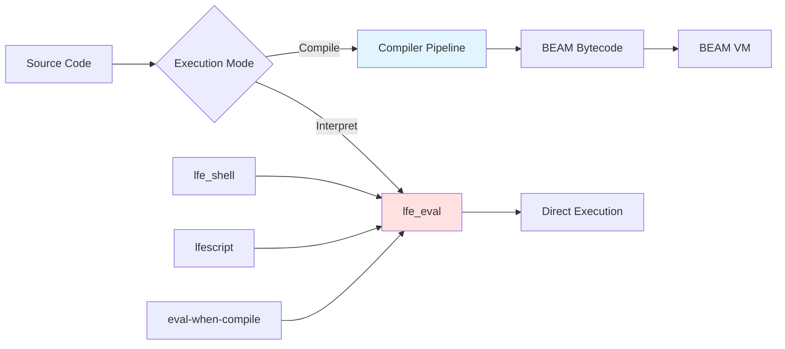

# Runtime System

LFE provides a **complete interpreter** alongside its compiler. This dual execution mode enables:

- **REPL** (interactive development)
- **lfescript** (scripting without compilation)
- **eval-when-compile** (compile-time code execution)
- **Dynamic code loading** (slurp command in shell)

**Shared components:**

- `lfe_scan` and `lfe_parse` - same frontend
- `lfe_macro` - same macro expansion
- `lfe_env` - same environment model

**Different backends:**

- **Compiler**: lfe_lint → lfe_codegen → lfe_translate → BEAM
- **Interpreter**: lfe_eval (direct execution)
