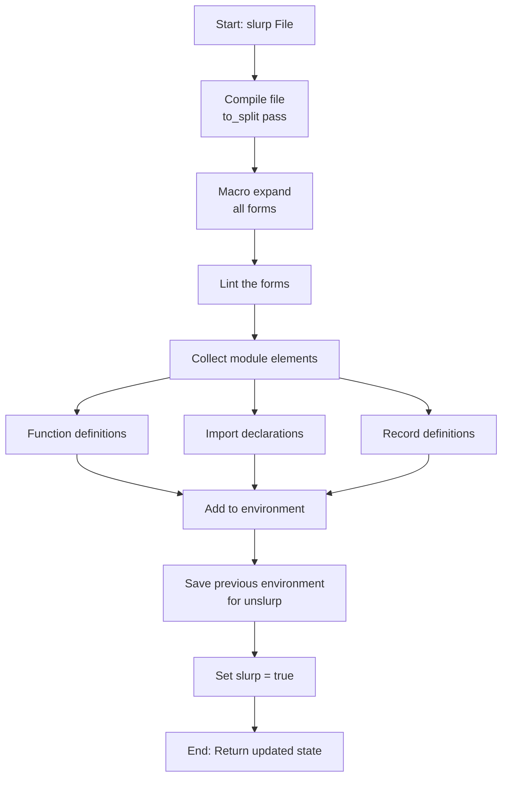

# Shell/REPL Architecture (lfe_shell.erl)

**Purpose**: Interactive Read-Eval-Print Loop for development.

**Module**: `lfe_shell.erl` (1,188 LOC) - Location: `src/lfe_shell.erl`

**Shell state**:

```erlang
-record(state, {
    curr,          % Current environment
    save,          % Saved environment (before slurp)
    base,          % Base environment (initial state)
    slurp = false  % Are we in slurp mode?
}).
```

**Three-environment model**:

1. **Base environment**: Initial pristine state with shell functions/macros/vars
2. **Current environment**: Active environment for evaluation
3. **Save environment**: Checkpoint for `slurp`/`unslurp`

**Shell startup** (src/lfe_shell.erl:119-131):

```erlang
server() ->
    St = new_state("lfe", []),  % Create default state
    process_flag(trap_exit, true),  % Must trap exits
    display_banner(),
    % Set up tab completion
    io:setopts([{expand_fun, fun(B) -> lfe_edlin_expand:expand(B) end}]),
    Eval = start_eval(St),  % Start evaluator process
    server_loop(Eval, St)
```

**Two-process architecture**:

```
┌──────────────────┐         ┌─────────────────────┐
│  Shell Process   │ <-----> │  Evaluator Process  │
│  - I/O handling  │  msgs   │  - Expression eval  │
│  - History       │         │  - Pattern matching │
│  - State mgmt    │         │  - Isolated crashes │
└──────────────────┘         └─────────────────────┘
```

**Why separate processes?**

- **Isolation**: Evaluator crashes don't kill shell
- **Restart**: Can restart evaluator after error
- **Stack traces**: Cleaner error reporting

**Read-Eval-Print loop**:

```erlang
server_loop(Eval0, St0) ->
    Prompt = prompt(),
    {Ret, Eval1} = read_expression(Prompt, Eval0, St0),
    case Ret of
        {ok, Form} ->
            {Eval2, St1} = shell_eval(Form, Eval1, St0),
            server_loop(Eval2, St1);
        {error, E} ->
            list_errors([E]),
            server_loop(Eval1, St0)
    end
```

**Shell variables** (src/lfe_shell.erl:302-320):

```erlang
add_shell_vars(Env0) ->
    % Add special shell expression variables
    Env1 = foldl(fun (Symb, E) -> lfe_env:add_vbinding(Symb, [], E) end,
                 Env0,
                 ['+', '++', '+++',  % Previous expressions
                  '-',               % Current expression
                  '*', '**', '***']),  % Previous values
    lfe_env:add_vbinding('$ENV', Env1, Env1)  % Environment itself

update_shell_vars(Form, Value, Env0) ->
    % Rotate history
    Env1 = lfe_env:add_vbinding('+++', fetch('++', Env0), Env0),
    Env2 = lfe_env:add_vbinding('++', fetch('+', Env1), Env1),
    Env3 = lfe_env:add_vbinding('+', Form, Env2),
    Env4 = lfe_env:add_vbinding('***', fetch('**', Env3), Env3),
    Env5 = lfe_env:add_vbinding('**', fetch('*', Env4), Env4),
    Env6 = lfe_env:add_vbinding('*', Value, Env5),
    Env7 = lfe_env:add_vbinding('-', Form, Env6),
    update_env(Env7)
```

**Shell-specific forms**:

```lisp
(set Pattern Expr)         ; Pattern matching assignment
(slurp File)               ; Load file into shell
(unslurp)                  ; Revert to pre-slurp state
(run File)                 ; Execute shell commands from file
(reset-environment)        ; Reset to base environment
```

**Shell functions** (builtin commands):

```erlang
% Compilation
(c file)                   % Compile and load LFE file
(ec file)                  % Compile and load Erlang file
(l modules)                % Load/reload modules

% Information
(help)                     % Show help
(h module), (h module function)  % Documentation
(i), (i pids)             % Process information
(m), (m module)           % Module information
(memory)                   % Memory statistics

% File system
(cd dir)                   % Change directory
(pwd)                      % Print working directory
(ls [dir])                 % List files

% Printing
(p expr)                   % Print in LFE format
(pp expr)                  % Pretty-print in LFE format
(ep expr)                  % Print in Erlang format
(epp expr)                 % Pretty-print in Erlang format

% Utilities
(clear)                    % Clear screen
(flush)                    % Flush messages
(q), (exit)               % Quit shell
```

**Slurp mechanism** (src/lfe_shell.erl:559-601):

```erlang
slurp([File], St0) ->
    {ok, St1} = unslurp(St0),  % Reset first
    Name = lfe_eval:expr(File, Curr),
    case slurp_file(Name) of
        {ok, Mod, Forms, Env, Warnings} ->
            % Collect functions, imports, records
            Sl = collect_module_forms(Forms),
            % Add to environment
            Env1 = add_imports(Sl#slurp.imps, Env),
            Env2 = add_functions(Sl#slurp.funs, Env1),
            Env3 = add_records(Sl#slurp.recs, Env2),
            % Merge with current environment
            Env4 = lfe_env:add_env(Env3, Curr),
            % Save old environment
            {{ok, Mod}, St1#state{save = Curr, curr = Env4, slurp = true}};
        {error, ...} ->
            {error, St1}
    end
```

**Slurp Flow**:


